# SpeaQ + SAM3 完整管线竖版流程图（不含 Mask）

基于代码库 `SpeaQ/modeling/` 真实数据流重新梳理，涵盖从输入到输出的全部核心模块：
- `detr.py` (IterativeRelationDETR)
- `transformer.py` (IterativeRelationTransformer + IterativeRelationDecoder)
- `sam3_backbone.py` (Sam3MaskedBackbone + PatchMerge)
- `criterion.py` (IterativeRelationCriterion + aux matching)
- `matcher.py` (SpeaQHungarianMatcher)
- `roi_refine.py` (ROIRefineHead)
- `triplet_memory.py` (TripletMemoryManager)
- `meta_arch/detr.py` (Detr inference + post-processing)

图中不包含 SAM3 tracking mask 分支。

## Figure: Complete Pipeline Vertical Flowchart

```mermaid
flowchart TB
    %% ============================================================
    %% PHASE 1: INPUT & BACKBONE
    %% ============================================================
    subgraph P1["PHASE 1 — Input & Backbone Feature Extraction"]
        direction TB
        A1["Video mini-batch\nsame-video clip sampling"] --> A2["Current frame image I_t\nresized to 1008×1008"]
        A1 --> A3["Metadata\nvideo_id, frame_idx"]
        A2 --> B1["SAM3 Visual Backbone\nforward at native stride ≈14"]
        B1 --> B2["Feature map F_native\n[B, 256, 72, 72]  stride≈14"]
        B2 --> B3{"USE_PATCH_MERGE?"}
        B3 -- "Yes (default)" --> B4["Pixel-Unshuffle (k=2)\nspace-to-depth: [B,256,72,72] → [B,1024,36,36]\nlossless rearrangement"]
        B4 --> B5["1×1 Conv (1024→256)\ninit = avg_pool equivalent\nlearnable sub-pixel fusion"]
        B5 --> B6["Feature map F_down\n[B, 256, 36, 36]  stride≈28"]
        B3 -- "No" --> B7["avg_pool2d (2×2, stride=2)\ninformation-destructive"]
        B7 --> B6
        B2 --> B8["Cache aux features\n{stride14: F_native}\nfor ROI_REFINE later"]
        B6 --> B9["Position Encoding\nsinusoidal / learned"]
        B6 --> B10["Padding Mask"]
    end

    %% ============================================================
    %% PHASE 2: TEMPORAL FEATURE AGGREGATION
    %% ============================================================
    subgraph P2["PHASE 2 — Temporal Feature Aggregation (optional)"]
        direction TB
        C1{"TEMPORAL.ENABLED\n&& MODE==feature_ema?"} -->|Yes| C2["TemporalAggregator\nEMA over feature maps\nH_t = σ(α)·H_{t-1} + (1-σ(α))·g(F_t)"]
        C2 --> C3["Temporally enhanced\nfeature map F_t'"]
        C1 -->|No| C4["Skip — use F_down as-is"]
    end

    %% ============================================================
    %% PHASE 3: TRANSFORMER
    %% ============================================================
    subgraph P3["PHASE 3 — IterativeRelationTransformer"]
        direction TB
        D0["Input Projection\n1×1 Conv: backbone_dim → hidden_dim(256)"] --> D1["Flatten + Transpose\n[B,C,H,W] → [HW,B,C]"]
        D1 --> D2["Transformer Encoder\n6-layer global self-attention\nover ~1296 spatial tokens\nwith position encoding"]
        D2 --> D3["Encoder Memory\n[HW, B, 256]"]

        D3 --> D4["IterativeRelationDecoder\n6-layer chain: Subject → Object → Relation"]

        subgraph P3_DEC["Decoder Layer Detail (×6 layers)"]
            direction TB
            E1["Subject Query Q_sub"] --> E1a["Subject Self-Attn +\nCross-Attn(Encoder Memory)"]
            E1a --> E1b["Subject Features hs_sub"]
            E1b --> E2["Object Query Generator\nQ_obj attends to hs_sub\n→ conditional object pos"]
            E2 --> E2a["Object Self-Attn +\nCross-Attn(Encoder Memory)"]
            E2a --> E2b["Object Features hs_obj"]
            E2b --> E3["Relation Query Generator\nQ_rel attends to hs_sub + hs_obj\n→ conditional relation pos"]
            E3 --> E3a["Relation Self-Attn +\nCross-Attn(Encoder Memory)"]
            E3a --> E3b["Relation Features hs_rel"]
            E3b --> E4{"Layer < N-1?"}
            E4 -->|"Yes (graph msg passing)"| E5["Triplet Feature Fusion\ncat(hs_sub, hs_obj, hs_rel) × multiply_q"]
            E5 --> E6["Graph Attention\nsubject/object/relation queries\nattend to triplet features"]
            E6 --> E7["Residual Update\n→ next layer Q_sub, Q_obj, Q_rel"]
            E4 -->|"No (last layer)"| E8["Output: hs_subject_last\nhs_object_last, hs_relation_last"]
        end

        D4 --> E1
        E7 --> E1
        E8 --> D5["Prediction Heads"]
    end

    %% ============================================================
    %% PHASE 4: PREDICTION HEADS
    %% ============================================================
    subgraph P4["PHASE 4 — Prediction Heads"]
        direction TB
        D5 --> F1["Object Embed\n→ relation_subject_logits [L,Q,B,C+1]\n→ relation_object_logits  [L,Q,B,C+1]"]
        D5 --> F2["Object Bbox Coord\n→ relation_subject_coords [L,Q,B,4]\n→ relation_object_coords  [L,Q,B,4]"]
        D5 --> F3["Relation Embed\n→ relation_logits [L,Q×M,B,R+1]"]
        D5 --> F4["Object Bbox Coord\n→ relation_coords [L,Q×M,B,4]"]

        F1 --> F5{"OBJ_SPLIT.ENABLED?"}
        F5 -->|Yes| F6["SplitObjectClassifier\nregular / small_shared / fine_groups\n+ temperature scaling\n+ upsample for small classes"]
        F6 --> F7["Unified full-class logits\n+ raw_split_logits\n+ head_source_idx"]
        F5 -->|No| F8["Standard Linear classifier"]
    end

    %% ============================================================
    %% PHASE 5: TRIPLET MEMORY READ & INJECT
    %% ============================================================
    subgraph P5["PHASE 5 — Triplet Memory Read & Injection (temporal_v3, optional)"]
        direction TB
        G1{"TRIPLET_MEMORY_ENABLED\n&& (training || temporal_eval)?"} -->|Yes| G2["TripletMemoryManager\n.get_batch_memory(video_ids, frame_idxs)"]
        G2 --> G3["maybe_clear_on_video_jump\nreset bank if frame_idx regresses"]
        G3 --> G4["Select TripletMemoryBank\nfor current video_id"]
        G4 --> G5["Collect valid slots\n(valid=True, feat exists)"]
        G5 --> G6{"Any valid slots?"}
        G6 -->|No| G7["Skip injection\nkeep original decoder output"]
        G6 -->|Yes| G8["Stack slot features [M×128]\n+ delta-time bucket embedding\nΔt = current - slot frame_idx"]
        G8 --> G9["Score-weight: feat *= slot_score"]
        G9 --> G10["Pad to batch\nmemory: [B, M_max, 128]\nmask: [B, M_max]"]

        G10 --> G11["Gate Schedule\ntriplet_iter_counter += 1\n0 before 10% max_iter\nlinear warmup 10%→30%\nthen gate_max"]
        G11 --> G12["Object gate_max = 0.15\nRelation gate_max = 0.30"]

        G12 --> G13["TemporalTripletInjector (Object)\nQ_obj* = Q_obj + gate_obj · CrossAttn(Q_obj, memory)"]
        G13 --> G14["Recompute final object\nlogits + boxes (last layer only)"]
        G12 --> G15["TemporalTripletInjector (Relation)\nQ_rel* = Q_rel + gate_rel · CrossAttn(Q_rel, memory)"]
        G15 --> G16["Recompute final relation\nlogits + boxes (last layer only)"]

        G14 --> G17["Temporally enhanced output"]
        G16 --> G17
        G7 --> G17
        G1 -->|No| G18["Skip — use original output"]
    end

    %% ============================================================
    %% PHASE 6: ROI REFINE
    %% ============================================================
    subgraph P6["PHASE 6 — ROI Refinement Head (optional)"]
        direction TB
        H1{"ROI_REFINE.ENABLED?"} -->|Yes| H2["Get aux features\nfrom backbone cache (stride≈14)\n[B, 256, 72, 72]"]
        H2 --> H3["RoIAlign on subject_boxes\npool_size=7×7\nbilinear interpolation"]
        H2 --> H4["RoIAlign on object_boxes\npool_size=7×7\nbilinear interpolation"]
        H3 --> H5["Conv Head\nLinear→ReLU→LayerNorm→Linear"]
        H4 --> H5
        H5 --> H6["Linear Classifier\n→ roi_subject_logits\n→ roi_object_logits"]
        H6 --> H7{"USE_GATE?"}
        H7 -->|Yes| H8["Learned Gate γ\nConvex Fusion:\nlogit = γ·logit_roi + (1-γ)·logit_orig"]
        H7 -->|No| H9["Direct replacement\nfor small boxes"]
        H8 --> H10["ROI refined logits\n+ roi_subject/object_mask"]
        H9 --> H10
        H10 --> H11{"APPLY_TO == 'small_only'?"}
        H11 -->|Yes| H12["Replace only boxes\nwith area < SMALL_AREA_THRESH"]
        H11 -->|No| H13["Replace all boxes"]
        H12 --> H14["Final: ROI logits replace\noriginal logits for small objects"]
        H13 --> H14
        H1 -->|No| H15["Skip ROI refine"]
    end

    %% ============================================================
    %% PHASE 7: OUTPUT ASSEMBLY
    %% ============================================================
    subgraph P7["PHASE 7 — Output Assembly"]
        direction TB
        G17 --> I1["Assemble output dict"]
        G18 --> I1
        H14 --> I1
        H15 --> I1
        I1 --> I2["relation_boxes (final layer)\nrelation_logits (final layer)\nrelation_subject_logits / boxes\nrelation_object_logits / boxes"]
        I1 --> I3["hs_subject_last\nhs_object_last\nhs_relation_last"]
        I1 --> I4["ROI refined logits\n(if enabled)"]
        I1 --> I5["Aux outputs\n(all decoder layers)"]
        I1 --> I6["Obj split metadata\nraw_split_logits, head_source_idx"]
    end

    %% ============================================================
    %% PHASE 8: LOSS COMPUTATION (training only)
    %% ============================================================
    subgraph P8["PHASE 8 — Loss Computation (training only)"]
        direction TB
        J1["IterativeRelationCriterion.forward"] --> J2["SpeaQHungarianMatcher\nTriplet-level bipartite matching"]
        J2 --> J3["Cost Matrix C_ij:\ncost_class(subject) + cost_class(object)\n+ cost_class(relation)\n+ cost_bbox(subject) + cost_bbox(object)\n+ cost_giou(subject) + cost_giou(object)"]
        J3 --> J4["Hungarian Algorithm\none-to-one or one-to-K assignment"]
        J4 --> J5["Indices:\nmatched subject queries\nmatched object queries\nmatched relation queries"]

        J5 --> J6["Primary Losses"]
        J6 --> J7["loss_ce_relation\nloss_ce_subject + loss_ce_object"]
        J6 --> J8["loss_bbox_subject + loss_bbox_object\n(L1 + GIoU/CIoU/EIoU)"]
        J6 --> J9["loss_bbox_relation (L1 + GIoU)"]
        J6 --> J10["Corner loss (optional)"]

        J5 --> J11{"OBJ_MISSED_AUX\n.ENABLED?"}
        J11 -->|Yes| J12["build_quality_aware_aux_indices\nSecondary object-level Hungarian\non missed GT + background queries"]
        J12 --> J13["Aux Loss:\nloss_aux_subject_cls\nloss_aux_object_cls\n(w_aux = 0.2)"]
        J13 --> J14["Mask aux-matched queries\nfrom primary background CE\n→ ignore_index = -100"]
        J11 -->|No| J15["Skip aux matching"]

        J5 --> J16{"ROI_REFINE\n.LOSS_ENABLED?"}
        J16 -->|Yes| J17["ROI Refine Loss:\nloss_roi_subject_cls\nloss_roi_object_cls\n(CE on ROI-refined logits)"]
        J16 -->|No| J18["Skip ROI loss"]

        J7 --> J19["Total Loss = Σ w_i · loss_i"]
        J8 --> J19
        J9 --> J19
        J10 --> J19
        J13 --> J19
        J17 --> J19
    end

    %% ============================================================
    %% PHASE 9: MEMORY UPDATE (training or temporal_eval)
    %% ============================================================
    subgraph P9["PHASE 9 — Memory Update (training or temporal_eval)"]
        direction TB
        K1{"TRIPLET_MEMORY_ENABLED?"} -->|Yes| K2["Triplet Candidate Construction\nunder torch.no_grad()"]
        K2 --> K3["Compute probabilities\nsoftmax(subject/object/relation)"]
        K3 --> K4["Choose labels + scores\nsub_score, obj_score, pred_score"]
        K4 --> K5["Triplet Quality:\nq = sub_score × obj_score × pred_score"]
        K5 --> K6["Top-K selection\nK = TRIPLET_MEMORY_TOPK_UPDATE (16)"]
        K6 --> K7["Threshold filtering\nq ≥ UPDATE_SCORE_THRESH (0.10)"]
        K7 --> K8["Build candidate signature\n(sub_label, pred_label, obj_label)"]
        K8 --> K9["Convert boxes: cxcywh → xyxy\n+ make union box"]
        K9 --> K10["TripletMemoryEncoder\nencode from: relation query\n+ sub/obj boxes + pred distribution"]
        K10 --> K11["Candidate dict:\n{signature, feat, boxes, scores}"]

        K11 --> K12["TripletMemoryManager\n.update_batch()"]
        K12 --> K13["For each video bank:"]
        K13 --> K14["Find matching slot\nsame signature\n+ mean IoU(sub,obj,union) > 0.3"]
        K14 --> K15{"Matched?"}
        K15 -->|Yes| K16["EMA Update\nfeat/boxes momentum=0.9\nscore = max(history, current)\nmiss=0, age+=1"]
        K15 -->|No| K17{"Free slot?"}
        K17 -->|Yes| K18["Insert new slot"]
        K17 -->|No| K19["Replace weakest slot\nmin(score - 0.05×miss)"]
        K16 --> K20["Expire unmatched slots\nmiss+=1, invalid if miss>2"]
        K18 --> K20
        K19 --> K20
        K20 --> K21["Memory bank ready\nfor next frame"]

        K1 -->|No| K22["Skip triplet memory update"]

        K23{"Object Memory Bank\n(temporal_v1)?"} -->|Yes| K24["ObjectMemoryBank.update\nEMA or matched_GT mode"]
        K24 --> K25["Store hs_subject + hs_object\n+ logits + boxes"]
        K23 -->|No| K26["Skip"]
    end

    %% ============================================================
    %% PHASE 10: INFERENCE POST-PROCESSING (eval only)
    %% ============================================================
    subgraph P10["PHASE 10 — Inference Post-Processing (eval only)"]
        direction TB
        L1["Output from Phase 7"] --> L2["Extract final layer predictions\nsubject/object/relation logits + boxes"]
        L2 --> L3["Multiply query expansion\nrepeat subject/object × multiply_q"]
        L3 --> L4{"PNMS enabled?"}
        L4 -->|Yes| L5["Pairwise NMS\ngroup by (sub,obj,pred) triplet\nNMS on subject+object boxes"]
        L4 -->|No| L6["Standard NMS\nbatched_nms on all boxes\nIoU-based classwise filtering"]
        L5 --> L7["Keep indices"]
        L6 --> L7
        L7 --> L8["QualityAux Discount\npenalize low-score detections\nwith high IoU to higher-score same-class boxes"]
        L8 --> L9["Triplet Confidence Blending\n(optional triplet_alpha)\nboost detection scores with relation conf"]
        L9 --> L10["Build Instances\npred_boxes, scores, pred_classes"]
        L10 --> L11["Build Relation Triplets\nrel_pair_idx, rel_labels, rel_scores"]
        L11 --> L12["ROI cls post-placement\n(if ROI_REFINE enabled at eval)\nreplace pred_classes with ROI cls\nfor qualifying small objects"]
        L12 --> L13["Final Result:\nInstances + Relations\n→ Scene Graph Evaluation\n(R@K, mR@K, SGRecall, SGMeanRecall)"]
    end

    %% ============================================================
    %% STYLING
    %% ============================================================
    classDef input fill:#f0f4f8,stroke:#334e68,stroke-width:1px,color:#243b53
    classDef backbone fill:#dbe9f8,stroke:#1d4e89,stroke-width:1px,color:#1a365d
    classDef temporal fill:#fff3d4,stroke:#b36b00,stroke-width:1px,color:#5c3d00
    classDef transformer fill:#d4f1f9,stroke:#0b6e7a,stroke-width:1px,color:#00444d
    classDef heads fill:#e5f6e0,stroke:#2a7f3f,stroke-width:1px,color:#1a4d24
    classDef memory fill:#fce8d5,stroke:#c2510a,stroke-width:1px,color:#662f00
    classDef roi fill:#f0e5fc,stroke:#6f42c1,stroke-width:1px,color:#3d1a6e
    classDef loss fill:#fde2e4,stroke:#b3261e,stroke-width:1px,color:#66100b
    classDef inference fill:#e2e8f0,stroke:#475569,stroke-width:1px,color:#1e293b
    classDef decision fill:#ffffff,stroke:#64748b,stroke-width:1px,stroke-dasharray:4 2,color:#334155

    class A1,A2,A3 input
    class B1,B2,B3,B4,B5,B6,B7,B8,B9,B10 backbone
    class C1,C2,C3,C4 temporal
    class D0,D1,D2,D3,D4,D5,E1,E1a,E1b,E2,E2a,E2b,E3,E3a,E3b,E4,E5,E6,E7,E8 transformer
    class F1,F2,F3,F4,F5,F6,F7,F8 heads
    class G1,G2,G3,G4,G5,G7,G8,G9,G10,G11,G12,G13,G14,G15,G16,G17,G18,K1,K2,K3,K4,K5,K6,K7,K8,K9,K10,K11,K12,K13,K14,K16,K18,K19,K20,K21,K22,K23,K24,K25,K26 memory
    class H1,H2,H3,H4,H5,H6,H7,H8,H9,H10,H11,H12,H13,H14,H15 roi
    class I1,I2,I3,I4,I5,I6 output
    class J1,J2,J3,J4,J5,J6,J7,J8,J9,J10,J11,J12,J13,J14,J15,J16,J17,J18,J19 loss
    class L1,L2,L3,L4,L5,L6,L7,L8,L9,L10,L11,L12,L13 inference
    class B3,C1,E4,F5,G1,G6,H1,H7,H11,J11,J16,K1,K15,K17,K23,L4 decision
```

## 图注

**Figure X. Complete vertical flowchart of the SpeaQ+SAM3 Scene Graph Generation pipeline (tracking-mask branch excluded).** 
The pipeline progresses through 10 phases:
1. Input preprocessing and SAM3 backbone feature extraction with Pixel-Unshuffle Patch Merge for information-preserving downsampling;
2. Optional temporal feature-level EMA aggregation;
3. IterativeRelationTransformer with 6-layer Subject→Object→Relation chain decoding and triplet graph message passing;
4. Multi-head prediction (subject/object classification + bounding box regression, relation classification);
5. Optional Triplet Memory read with delta-time encoding and gated cross-attention injection into final-layer object/relation queries;
6. Optional ROI Refinement Head extracting stride-14 features via RoIAlign for small-object classification improvement;
7. Output dictionary assembly;
8. Training loss computation with triplet Hungarian matching, optional object-level auxiliary matching for missed GT, and ROI refine CE loss;
9. Memory update — triplet candidate construction (top-K by quality score) and per-video bank management (EMA, insert, replace, expire);
10. Inference post-processing with NMS, QualityAux discount, triplet confidence blending, and ROI cls post-placement.

## 中文图注

**图 X. SpeaQ+SAM3 场景图生成完整管线竖版流程图（不含 tracking mask 分支）。**
管线分为 10 个阶段：
1. 输入预处理与 SAM3 骨干特征提取，含 Pixel-Unshuffle Patch Merge 信息保持下采样；
2. 可选的时序特征级 EMA 聚合；
3. IterativeRelationTransformer 6 层 Subject→Object→Relation 链式解码与三元组图消息传递；
4. 多头预测输出（主体/客体分类+框回归、关系分类）；
5. 可选的三元组记忆读取——含时间差编码与门控交叉注意力注入最终层客体/关系查询；
6. 可选的 ROI 细化头——从 stride-14 特征经 RoIAlign 提取区域特征改善小目标分类；
7. 输出字典组装；
8. 训练损失计算——三元组匈牙利匹配、可选的目标级遗漏 GT 辅助匹配、ROI 细化 CE 损失；
9. 记忆更新——三元组候选构造（按质量分 Top-K）与逐视频记忆库管理（EMA、插入、替换、过期）；
10. 推理后处理——NMS、QualityAux 折扣、三元组置信度混合、ROI cls 后置替换。

## 代码对应关系

| Phase | 主要文件 | 关键类/函数 |
|-------|---------|------------|
| 1 | `sam3_backbone.py` | `Sam3MaskedBackbone.forward()`, `_apply_patch_merge()` |
| 2 | `detr.py` | `TemporalAggregator.forward()` |
| 3 | `transformer.py` | `IterativeRelationTransformer.forward()`, `IterativeRelationDecoder.forward()` |
| 4 | `detr.py` | `_predict_object_from_embeddings()`, `SplitObjectClassifier` |
| 5 | `triplet_memory.py`, `detr.py` | `TripletMemoryManager.get_batch_memory()`, `TemporalTripletInjector`, `_apply_triplet_memory_to_output()` |
| 6 | `roi_refine.py`, `detr.py` | `ROIRefineHead.forward()`, ROI refine block in `IterativeRelationDETR.forward()` |
| 7 | `detr.py` | `IterativeRelationDETR.forward()` output assembly |
| 8 | `criterion.py`, `matcher.py`, `obj_missed_aux.py` | `IterativeRelationCriterion.forward()`, `SpeaQHungarianMatcher.forward()`, `build_quality_aware_aux_indices()` |
| 9 | `triplet_memory.py`, `detr.py` | `TripletMemoryManager.update_batch()`, triplet update block in `forward()` |
| 10 | `meta_arch/detr.py` | `Detr.inference()`, `Detr.forward()` eval path |

## 关键配置项速查

| 配置路径 | 默认值 | 说明 |
|---------|--------|------|
| `MODEL.SAM3.USE_PATCH_MERGE` | `True` | 启用 Pixel-Unshuffle Patch Merge |
| `MODEL.SAM3.TARGET_STRIDE` | `32` | 目标特征步长 |
| `MODEL.TEMPORAL.ENABLED` | `False` | 启用时序记忆 |
| `MODEL.TEMPORAL.TRIPLET_MEMORY_ENABLED` | `False` | 启用三元组记忆 (temporal_v3) |
| `MODEL.TEMPORAL.GATE_MAX_OBJECT` | `0.15` | 客体注入门控上限 |
| `MODEL.TEMPORAL.GATE_MAX_RELATION` | `0.30` | 关系注入门控上限 |
| `MODEL.ROI_REFINE.ENABLED` | `False` | 启用 ROI 细化 |
| `MODEL.ROI_REFINE.SMALL_AREA_THRESH` | `0.001` | 小目标面积阈值 |
| `MODEL.OBJ_SPLIT.ENABLED` | `False` | 启用分头目标分类器 |
| `OBJ_MISSED_AUX.ENABLED` | `False` | 启用遗漏 GT 辅助匹配 |
| `OBJ_MISSED_AUX.AUX_LOSS_WEIGHT` | `0.2` | 辅助损失权重 |
