# 时序模块流程图（不含 Tracking Mask）

本文档给出本文时序模块的论文式流程图，聚焦 **Stage4 / Triplet Memory v3** 在单帧场景图生成主干中的插入位置。图中不包含 SAM3 tracking mask 分支，仅描述当前已使用的对象-关系三元组记忆库、时序注入和记忆更新流程。

## Figure: Temporal Triplet Memory Module

```mermaid
flowchart LR
    %% =========================
    %% Input and backbone
    %% =========================
    A[Video mini-batch<br/>same-video clip sampling] --> B[Frame image I_t]
    B --> C[SAM3 / X-SAM visual backbone<br/>patch-merge feature extraction]
    C --> D[DETR encoder-decoder]

    %% =========================
    %% Current-frame predictions
    %% =========================
    D --> E[Object queries Q_obj^t<br/>Relation queries Q_rel^t]
    E --> F[Current-frame predictions<br/>boxes, object labels, relation logits]

    %% =========================
    %% Memory read
    %% =========================
    A --> M0[video_id, frame_idx]
    M0 --> M1[Select memory bank<br/>B_vid for current video]
    M1 --> M2[Read valid triplet slots<br/>subject/object/relation embeddings<br/>score, age, class, box]
    M2 --> M3[Temporal memory encoder<br/>+ delta-time embedding]

    %% =========================
    %% Injection
    %% =========================
    M3 --> G1[Cross-attention injection]
    E --> G1
    G1 --> G2[Object / relation gated fusion]
    G2 --> H[Temporally enhanced queries<br/>Q_obj^t*, Q_rel^t*]
    H --> F

    %% =========================
    %% Loss and update
    %% =========================
    F --> L[Scene graph losses<br/>object / relation / box losses]
    F --> U1[Candidate triplet construction]
    U1 --> U2[Quality filtering<br/>score threshold + top-k]
    U2 --> U3[Match existing slots<br/>IoU / class / video-local state]
    U3 --> U4[EMA update or insert new slot]
    U4 --> M1

    %% =========================
    %% Styling
    %% =========================
    classDef input fill:#f7f7f7,stroke:#333,stroke-width:1px;
    classDef backbone fill:#e8f1ff,stroke:#1d4e89,stroke-width:1px;
    classDef memory fill:#fff4df,stroke:#b36b00,stroke-width:1px;
    classDef inject fill:#e9f8ee,stroke:#2a7f3f,stroke-width:1px;
    classDef loss fill:#fce8e6,stroke:#b3261e,stroke-width:1px;

    class A,B,M0 input;
    class C,D,E,F backbone;
    class M1,M2,M3,U1,U2,U3,U4 memory;
    class G1,G2,H inject;
    class L loss;
```

**图注建议：**  
**Figure X. Temporal triplet-memory pathway in the proposed video scene graph generation model.** For each frame, the visual backbone and DETR decoder produce object and relation queries. In parallel, a video-specific triplet memory bank is indexed by `video_id` and `frame_idx`, encoded with temporal information, and injected into current object/relation queries through cross-attention and learnable gates. After prediction, high-quality triplet candidates are selected and used to update the memory bank through matching and EMA-style slot updates.

## 中文图注

**图 X. 视频场景图生成中的三元组时序记忆模块流程。** 对于当前帧，SAM3 / X-SAM 视觉主干与 DETR 解码器首先产生目标查询和关系查询；与此同时，模型根据 `video_id` 与 `frame_idx` 读取当前视频对应的三元组记忆库。记忆槽中保存历史帧的主体、客体与关系表示，并通过时序编码后以交叉注意力形式注入当前查询。模型预测当前帧目标框、目标类别和关系类别后，再根据置信度、类别一致性和空间匹配结果筛选高质量三元组候选，并以插入或 EMA 更新的方式写回记忆库。

## 流程说明

### 1. 当前帧特征与查询生成

输入视频帧 `I_t` 首先经过 SAM3 / X-SAM 视觉主干得到视觉特征。若启用 patch-merge，模型通过 pixel-unshuffle 与可学习的 `1×1` 卷积完成下采样，以降低 DETR encoder 的显存开销。随后 DETR encoder-decoder 产生当前帧的对象查询 `Q_obj^t` 和关系查询 `Q_rel^t`。

### 2. 按视频索引的时序记忆读取

时序模块不使用全局共享 memory，而是根据 `video_id` 为每个视频维护独立的 triplet memory bank。每个 memory slot 存储历史三元组的主体、客体、关系表示，以及类别、框、置信度、年龄等元信息。当前帧到来时，模型读取同一视频下有效的 memory slot，并结合 `frame_idx` 形成时间差编码。

### 3. 跨帧记忆注入

读取出的历史三元组记忆经过 temporal memory encoder 后，作为 cross-attention 的 key/value，与当前帧对象和关系查询进行交互。注入结果通过可学习门控控制强度：对象查询与关系查询可以使用不同的最大门控上限，使模型在训练中自动学习是否依赖历史信息，以及依赖多强的历史信息。

### 4. 当前帧预测与损失

时序增强后的查询进入常规的场景图预测头，输出目标框、目标类别、关系类别和相关辅助监督。训练损失仍以当前关键帧的场景图监督为主，包括目标分类、框回归、关系分类等项；时序记忆模块本身通过影响查询表示间接参与这些损失的反向传播。

### 5. 记忆更新

当前帧预测完成后，模型从预测结果中构建候选三元组。候选项经过置信度阈值、top-k 筛选、类别与 IoU 匹配后，用于更新当前视频的 memory bank。若候选与已有 slot 匹配，则进行 EMA 风格的平滑更新；若没有匹配且 memory 未满，则插入新 slot；若 memory 已满，则根据分数和年龄替换较弱的 slot。

## 与完整模型的关系

该图仅展示时序模块相关路径，不展示 ROI refinement、tracking mask、obj-split、quality auxiliary loss 等其他分支。完整模型中，时序模块位于视觉 backbone / DETR decoder 之后、最终 prediction head 之前，作用是将同一视频历史帧中稳定的对象-关系结构作为上下文注入当前帧查询，从而提升视频场景图预测的一致性。