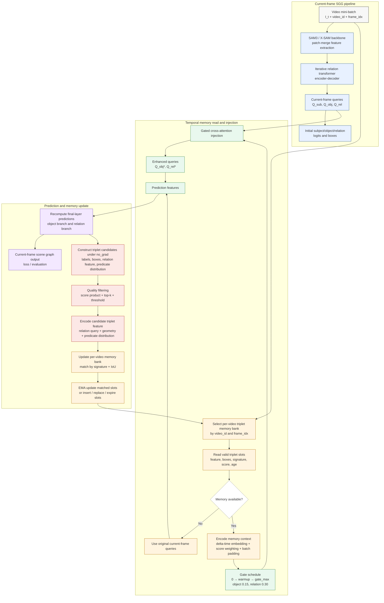

# 简化竖版流程图：Temporal Triplet Memory（不含 Tracking Mask）

本图是在详细版 `temporal_module_flowchart_detailed_vertical.md` 的基础上合并节点后的论文展示版本。它保留时序模块的核心逻辑：**按视频读取历史三元组记忆 → 门控交叉注意力注入当前查询 → 当前帧预测 → 构造高质量三元组 → 更新 per-video memory bank**。图中不包含 SAM3 tracking mask 分支。

## Figure: Simplified Vertical Flowchart

## 图注建议

**Figure X. Simplified vertical flowchart of the Temporal Triplet Memory module.** For each video frame, the SAM3/X-SAM backbone and iterative relation transformer produce current-frame subject, object, and relation queries. A video-specific triplet memory bank is then indexed by `video_id` and `frame_idx`; valid memory slots are temporally encoded and score-weighted before being injected into the object and relation queries through gated cross-attention. The enhanced queries are used to recompute final-layer predictions, and high-quality current-frame triplets are encoded and written back to the same per-video memory bank through signature-and-IoU matching, EMA update, insertion, replacement, and expiration.

## 中文图注

**图 X. 三元组时序记忆模块的简化竖版流程。** 当前视频帧首先经过 SAM3/X-SAM 主干和迭代关系 Transformer，得到主体、客体与关系查询。模型随后根据 `video_id` 和 `frame_idx` 读取对应视频的三元组记忆库，将有效记忆槽进行时间差编码和置信度加权后，通过门控交叉注意力注入客体查询与关系查询。增强后的查询用于重算最终层预测；当前帧中的高质量三元组再被编码并写回同一视频记忆库，通过类别签名与 IoU 匹配完成 EMA 更新、插入、替换和过期清理。

## 与详细版相比的合并点

- 将 `maybe_clear_on_video_jump`、bank 创建、valid slot 收集合并为“Select / Read per-video memory bank”。
- 将 delta-time embedding、score weighting、batch padding 合并为“Encode memory context”。
- 将 object/relation 两条 injection 分支合并为一个 gated cross-attention 节点，仅在增强查询处注明 `Q_obj*` 和 `Q_rel*`。
- 将 softmax、label/score 选择、box 转换、union box 构造合并为“Construct triplet candidates”。
- 将 match、EMA、insert、replace、expire 合并为两级 memory update 节点。
